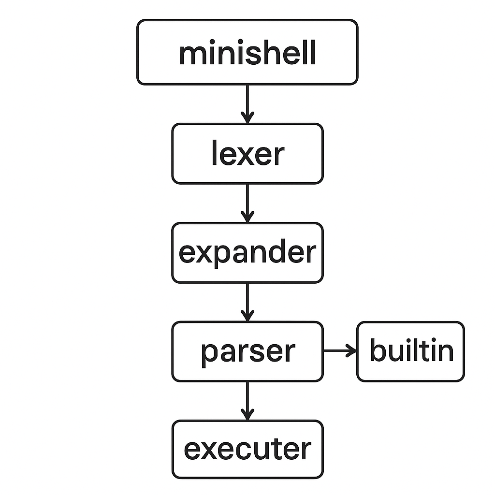

// valgrind --leak-check=full --show-leak-kinds=all --suppressions=readline.supp --track-fds=yes ./minishell  ( readline dan gelen sızıntıyı göstermez
<!-- ====================================================== -->
<!-- 🌙 Minishell — by Enes Kahraman, 42 Kocaeli -->
<!-- ====================================================== -->

<p align="center">
  
</p>

---

<p align="center">
  
  
  
  
</p>

---

## 🧠 Proje Hakkında

**Minishell**, 42 okullarında verilen sistem programlama projelerinden biridir.  
Amaç, bir Unix kabuğunun (bash benzeri) **kendi basitleştirilmiş sürümünü** yazmaktır.  
Bu proje ile **komut yorumlama, süreç yönetimi, sinyaller, pipe ve redirection** gibi konular öğrenilir.

> “Bir kabuğu anlamanın en iyi yolu, onu kendin yazmaktır.” — *42 Philosophy*

---

## 🧩 Öğrenilen Temeller

| Konu | Açıklama |
|------|-----------|
| 🧮 **Parsing & Tokenization** | Kullanıcı girişini ayrıştırma ve argümanlara bölme. |
| 🔁 **Pipes & Redirections** | Komutları birbirine bağlama ve yönlendirme. |
| ⚙️ **Process Control (fork/exec)** | Yeni işlemler yaratma ve program yürütme. |
| 🧵 **Signals** | Ctrl+C, Ctrl+D, Ctrl+\ gibi sinyalleri yakalama. |
| 🧰 **Environment Variables** | PATH, HOME gibi ortam değişkenlerinin yönetimi. |

---

## ⚙️ Kurulum ve Çalıştırma

### 📦 Gereksinimler
- macOS veya Linux  
- `gcc` veya `clang`  
- `make`

### 🧰 Derleme

```bash
git clone https://github.com/Celtenn/minishell.git
cd minishell
make
```

### ▶️ Çalıştırma

```bash
./minishell
```

### 🧨 Örnek Kullanımlar

```bash
minishell> echo Merhaba Dünya
Merhaba Dünya

minishell> ls -la | grep src
src/

minishell> export TEST=42
minishell> echo $TEST
42

minishell> cd ..
minishell> pwd
/home/enes
```

---

## 🖥️ Desteklenen Komutlar

| Komut | Açıklama |
|:------|:----------|
| `echo` | Yazıyı ekrana bastırır |
| `cd` | Dizin değiştirir |
| `pwd` | Mevcut dizini gösterir |
| `export` | Ortam değişkeni ekler |
| `unset` | Ortam değişkeni kaldırır |
| `env` | Ortam değişkenlerini listeler |
| `exit` | Kabuktan çıkar |

> 🔧 Ek olarak `|`, `>`, `<`, `>>`, `<<` (heredoc) yönlendirmeleri desteklenir.

---

## 🗂️ Örnek Proje Dizini

```
minishell/
├── includes/
│   └── minishell.h
├── srcs/
│   ├── main.c
│   ├── parser/
│   │   ├── lexer.c
│   │   ├── parser.c
│   │   └── tokenizer.c
│   ├── executor/
│   │   ├── exec.c
│   │   ├── pipe.c
│   │   └── redirection.c
│   ├── builtins/
│   │   ├── echo.c
│   │   ├── cd.c
│   │   ├── pwd.c
│   │   ├── env.c
│   │   ├── export.c
│   │   └── unset.c
│   └── utils/
│       ├── signals.c
│       ├── error.c
│       └── memory.c
├── Makefile
└── README.md
```

---

## 🧮 Teknik Detaylar

### 🔹 Komut Yürütme Akışı

1. **Input okuma** (`readline`)  
2. **Tokenize etme** (boşluk, pipe, redirection ayrımı)  
3. **Parse etme** (AST — Abstract Syntax Tree oluşturulur)  
4. **Fork & Exec** işlemleriyle komut çalıştırma  
5. **Sinyal yönetimi** ve bekleme (`waitpid`)

### 🔹 Örnek Akış Şeması

<p align="center">
  
</p>

---

## 🧰 Makefile Komutları

| Komut | Açıklama |
|--------|-----------|
| `make` | Projeyi derler |
| `make clean` | Ara dosyaları temizler |
| `make fclean` | Tüm derleme dosyalarını siler |
| `make re` | Baştan derler |

---

## 🧑‍💻 Yazar

**Enes Kahraman**  
📍 42 Kocaeli  
🔗 [GitHub: Celtenn](https://github.com/Celtenn)

---

## 🌟 Özellikler

✅ Multi-pipe desteği  
✅ Environment değişken yönetimi  
✅ Heredoc (`<<`) desteği  
✅ Hatalı syntax kontrolü  
✅ Sinyal yakalama (Ctrl+C, Ctrl+D)  
✅ Bellek sızıntısız yapı  

---

## 🧾 Lisans

Bu proje, **42 Kocaeli** kapsamında eğitim amaçlı olarak geliştirilmiştir.  
Tüm hakları **Enes Kahraman**’a aittir.  
Öğrenim ve paylaşım amacıyla kullanılabilir.

---

<p align="center">
  
</p>
